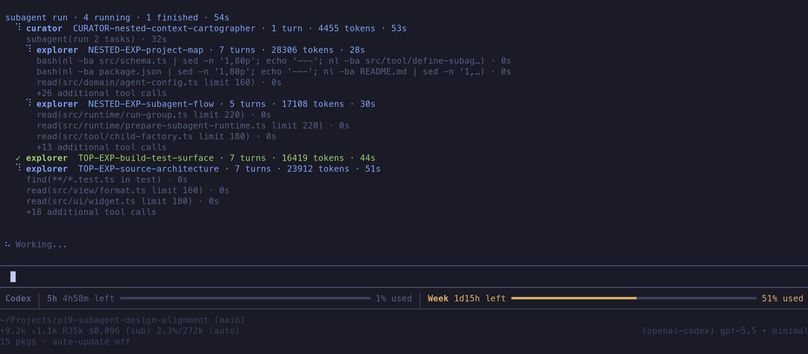

# @pi9/subagent

A Pi package that adds subagent delegation: a single `subagent` tool the main agent uses to spawn isolated child `AgentSession`s, watch their progress live, and pick up where they left off. Reach for it when work would crowd the parent conversation or benefits from an independent perspective — focused research, planning, review, bug investigation, test analysis, and implementation handoffs.



## Highlights

- **Resumable sessions** let the parent send follow-ups to the same child, which keeps its accumulated context across resumes instead of starting cold.
- **Background dispatch** runs a batch without blocking, so the parent keeps working and is notified when children finish.
- **Recursive subagents** spawn their own children, and the parent sees the whole tree as one run under a single shared concurrency limit.
- A **single tool** lists, spawns, resumes, collects, and cleans up, and its deliberately compact prompt won't bloat the parent's context.
- **Live, observable runs** show per-child status, turns, tokens, and tool calls in the tool row and a dockable widget, while lifecycle events and a persistent session index keep each one inspectable after it finishes.
- **Zero-code configuration** puts concurrency, notifications, discovery, and layout in settings, with sensible defaults.

## Install

```bash
pi install npm:@pi9/subagent
```

## Quick start

1. **Install** the package (above).
2. **Define an agent** — drop a markdown file in `.pi/agents/` (see [Define agents](#define-agents) for the full frontmatter):

```markdown
---
name: scout
description: Read-only codebase reconnaissance
model: anthropic/claude-sonnet-4
tools: read, bash
---

You are a fast codebase scout. Return concise, evidence-backed findings with file paths.
```

3. **Delegate to it** — just ask the main agent in plain language:

> Run a scout subagent to find the auth entry points and summarize the relevant files.

The agent translates that into a `subagent` tool call:

```ts
subagent({
  action: "run",
  tasks: [{ agent: "scout", prompt: "Find the auth entry points and summarize the relevant files." }]
})
```

4. **Watch it run** live in the tool row and the progress widget, then collect the result when it finishes.

## Define agents

Add a markdown file in a discovered `agents/` directory:

```markdown
---
name: scout
description: Read-only codebase reconnaissance
model: anthropic/claude-sonnet-4
tools: read, bash
skills: codesearch
resumable: true
---

You are a fast codebase scout. Inspect the repository and return concise, evidence-backed findings with file paths.
```

Supported frontmatter:

| Field | Required | Meaning |
| --- | --- | --- |
| `name` | yes | Runtime agent name used in tool calls. |
| `description` | yes | Short summary shown in tool results and browsers. |
| `model` | no | Model for this agent. Use `provider/model` or an unambiguous model id. |
| `thinking` | no | Thinking level for the child session. |
| `tools` | no | Comma-separated tool allowlist. If set, include `subagent` for agents that should be able to delegate recursively. |
| `skills` | no | Comma-separated default skill names injected into the system prompt. Per-task `skills` replaces this list (no merge); use `none` or omit to declare none. |
| `resumable` | no | Boolean. When `true`, conversation context is retained for follow-up prompts. This is separate from background result retention. Resumability lasts for the current Pi process only — restart or extension reload releases it. |

The markdown body is trimmed and used as the child's system prompt.

## Agent discovery

Agents are markdown files discovered from:

1. User `${PI_AGENT_DIR ?? ~/.pi/agent}/agents`.
2. The nearest project `.pi/agents`, found by walking up from the tool's `cwd`.

Each file is registered by its frontmatter `name`, not by filename. Project agents override user agents with the same name.

## Resumable sessions

Mark an agent `resumable: true` (or override per task) and its session is retained after it settles. The parent can then send a follow-up to the same `sessionId`, and the child continues with its accumulated context instead of starting cold. Spawns and resumes can be mixed in one batch:

```ts
subagent({
  action: "run",
  tasks: [
    { sessionId: "...", prompt: "Use your earlier findings to propose the smallest implementation plan." },
    { agent: "reviewer", prompt: "Independently review the new plan once it lands." }
  ]
})
```

Retention lasts for the current Pi process only — restart or extension reload releases it. Resume from the tool, or interactively from `/subagents`.

## Background dispatch

By default (`background: false`), a run waits for every task and returns their results. With `background: true`, the call returns session handles immediately while children continue independently. Background sessions stay available to `list` and `results` until removed, even when `resumable: false`; this result retention does not make their conversation context resumable.

```ts
subagent({
  action: "run",
  background: true,
  tasks: [{ agent: "scout", prompt: "Map auth code; respond when complete." }]
})
```

When a background child finishes, the parent is notified. The `backgroundNotify` setting decides how: coalesce until the parent is idle (`auto`), steer into the active turn (`steer`), or stay silent (`none`). Notifications carry only metadata — fetch the actual output with `subagent results`.

## Recursive subagents

Give an agent the `subagent` tool in its `tools` allowlist and it can spawn its own children. The parent sees the whole tree as one coherent run: nested children appear under their parent, counts and elapsed time aggregate across the tree, and a single shared concurrency limit applies across all levels so recursive fan-out stays bounded.

## Live display

While subagents run, two surfaces keep you in the loop: the tool row in the transcript, and a persistent widget outside it.

### Tool row

While a `run` is executing, the tool row shows one line per child with status, agent or `label`, turns, tokens, elapsed time, and its most recent tool calls. Finished children collapse to just their row:

```text
  ⠋ reviewer  auth review · 2 turns · 18420 tokens · 37s
    ⠋ bash npm test · 12s
    ✓ grep "formatRunSessionLine" in src · 1s
    ✓ read src/view/tool-result-lines.ts · 0s
    +2 additional tool calls
```

Expanding the tool call shows each child's prompt and full tool history. For resumed sessions, every previous run is shown as its own section above the current run, with its own prompt, tool history, and output. Mixed child failures still preserve successful results.

### Progress widget

A lightweight widget appears outside the tool row while there are active or retained resumable sessions, and auto-hides otherwise. Nested children appear under their parent with depth-based indentation.

Configure placement and layout in `/subagents settings`:

| Setting | Values |
| --- | --- |
| `widgetPlacement` | `belowEditor` (default), `aboveEditor`, `off`. `off` disables only the widget; tool rendering and `/subagents` still work. |
| `widgetLayout` | `auto` (default — columns when terminal is wide enough, otherwise stacked), `columns`, `stacked`. |

## Settings

Settings are global per user and stored at `${PI_AGENT_DIR ?? ~/.pi/agent}/subagent/settings.json`. The file is normalized with defaults the first time it's written, so opening it after a fresh install shows every supported key with its current value.

The runtime knobs are the ones most users will reach for:

```json
{
  "runtime": {
    "maxTasksPerRun": 8,
    "maxConcurrentSubagents": 4,
    "defaultResumable": false,
    "backgroundNotify": "auto"
  }
}
```

- `maxConcurrentSubagents` is a **tree-wide** cap across recursive subagents (one shared queue owns the whole subagent tree).
- `defaultResumable` only applies when an agent definition omits `resumable`; explicit frontmatter and per-task overrides still win.
- `backgroundNotify` controls how a finishing background subagent notifies the parent:
  - `auto` (default) — coalesce completion metadata and deliver it once the parent is idle.
  - `steer` — inject a steering-style notification into the currently active run, falling back to a new turn if idle.
  - `none` — do not notify; the parent must call `subagent list` or `subagent results` to discover completions.

Beyond runtime, the settings file also has an `agentDiscovery` section (toggles for user/project sources, file extensions, duplicate-name policy) and a `display` section (truncation lengths and widget row caps). Defaults are tuned to be reasonable; reach for them only when something is being cut off or you need to narrow discovery.

`/subagents settings` exposes the common controls; the rarer discovery and display knobs are file-only.

## `/subagents` command

Run `/subagents` to inspect and manage subagents from the UI.

When active or retained sessions exist, it opens the Sessions view, where you can:

- Inspect status, agent metadata, prompt preview, counters, timestamps, usage, and output/error snippets.
- Resume a completed resumable session (or a resume attempt that failed before re-attaching). The command asks for a follow-up prompt, runs with a cancellable loader, updates the widget live, and appends a concise result message to the main conversation.
- Remove a retained non-running session.
- Open Settings with `s`, or switch to the Agents browser with `tab` when discovery is available.

If no sessions exist, `/subagents` opens the read-only Agents browser, which lists discovered agent definitions and their metadata. It does not launch agents.

Run `/subagents settings` to open Settings directly, or `/subagents agents` / `/subagents sessions` to jump straight to a view. All views share the same movement keys, including configured select keybindings and `j`/`k`.

## Events and persistence

The package emits `queued`, `started`, and `completed` lifecycle events on the host event bus, so other extensions can react to subagent progress without polling the tool. Terminal sessions are also recorded in a persistent `subagent-session-index` entry — status, timing, prompt previews, and output/error snippets — so recent activity survives across Pi sessions. And when you try to switch or fork a session while children are still queued or running, the package warns first instead of silently abandoning that work.

## The `subagent` tool

The tool takes one required `action`. Its parameter shapes live in `src/schema.ts` and are surfaced to the agent through the tool schema; this is just the map of what each action does:

| Action | What it does |
| --- | --- |
| `agents` | List configured agent definitions, including tools, default skills, and `defaultResumable`. |
| `list` | List active and retained sessions; filter with `status`. |
| `run` | Spawn (via `agent`) and/or resume (via `sessionId`) a `tasks` array. `background: true` dispatches non-blocking. |
| `results` | Fetch results by `sessionIds` without blocking; `remove: true` sweeps terminal entries. |
| `remove` | Remove sessions by `sessionIds` or `scope`; running ones are aborted. |

Spawn tasks accept per-task overrides — `label`, `model`, `thinking`, `cwd`, `skills`, and `resumable`. Agent discovery calls the configured default `defaultResumable` because a task can override it. Successful results and session inventory expose the resolved `effectiveConfig` (`model`, `thinking`, `cwd`, `skills`, `tools`, and `resumable`) for debugging overrides. Sessions move through `queued → running → completed`, or end in `error`, `aborted`, `interrupted`, or `skipped`; only a `completed` resumable session (or a resume that failed before re-attaching) can be resumed. Results carry the child's full, untruncated `output` (or `error`), plus a `sessionId` to resume when the result is resumable.

Removal scopes select: `background` for all background-dispatched sessions, `retained` for non-running resumable foreground sessions, and `non-running` for every queued or terminal session.

## Architecture

```
src/
├── index.ts         — Extension entry; wires the registry, manager, tool, command, and widget.
├── schema.ts        — Zod schemas for tool parameters and structured results.
├── config/          — Settings types, defaults, and `settings.json` load/save.
├── domain/          — Pure domain model.
│   ├── agent.ts          — The Agent class: one child session, its attempts, and lifecycle.
│   ├── agent-registry.ts — Discovers and indexes agent definitions from user/project dirs.
│   ├── agent-snapshot.ts — Immutable state view used for rendering.
│   └── ...               — Config parsing, result projection, attempt/finalize/decision helpers.
├── runtime/         — Execution machinery.
│   ├── agent-manager.ts  — Top-level coordinator owning the registry, queue, and run groups.
│   ├── task-queue.ts     — Tree-wide concurrency queue shared across recursive subagents.
│   ├── run-group.ts      — One `run` call: tracks input order and surfaces tree state.
│   ├── run-agent.ts      — Builds and runs the underlying SDK AgentSession for one attempt.
│   └── ...               — Attempt dispatch, background notifier, extension cache, timing.
├── tool/            — The `subagent` tool: definition, action handlers, and the factory injected into children.
├── command/         — The `/subagents` slash command: registration, multi-step flows, and a `components/` subfolder with Sessions/Agents/Settings/resume-loader TUI components.
├── ui/widget.ts     — The persistent progress widget shown outside the tool row.
└── view/            — Rendering helpers shared by tool, command, and widget.
    ├── tool-result-lines.ts — Collapsed/expanded line generation for the tool row.
    ├── session-lines.ts     — Per-session line formatting used by widget and tool row.
    ├── widget-component.ts  — Top-level widget renderer with stacked vs. side-by-side layout.
    └── ...                  — Details payloads, serialization, resume message, format/view helpers.
```
