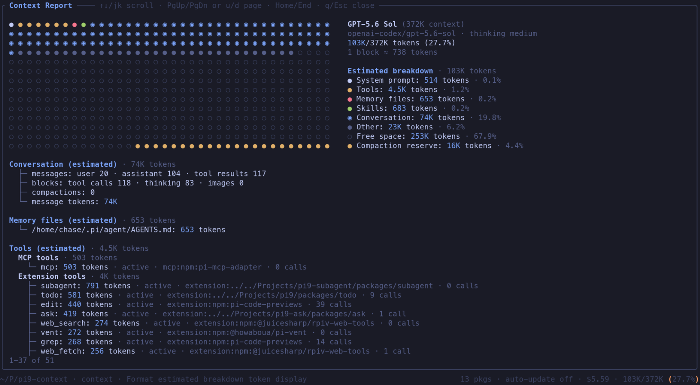

# @pi9/context

Pi extension that registers `/context` — a scrollable breakdown of how your current context window is being used (model, responsive usage graph, compaction reserve, conversation stats, memory files, tools, and skills).



## Usage

In an interactive pi session:

```text
/context
```

The report opens as an inline custom view in the main UI flow. Scroll with **↑/↓** or **j/k**, page with **PgUp/PgDn** or **u/d**, jump with **Home/End**, and close with **q** or **Esc** (Enter also closes).

In modes without extension UI support, the command shows a short warning only.

## Install

```bash
pi install npm:@pi9/context
```

For local development, load `packages/context/src/index.ts` as an extension.

## Development

```bash
npm run typecheck
npm test
```

### Manual verification

To verify the TUI end-to-end:

1. Start pi with this extension in a terminal at least 80 columns wide.
2. Run `/context` on a session with several messages so the report exceeds the viewport.
3. Confirm keyboard scrolling, help text, the responsive graph and displayed per-block token scale, section token totals, and **Esc** closes the inline view without injecting report text into the chat.
