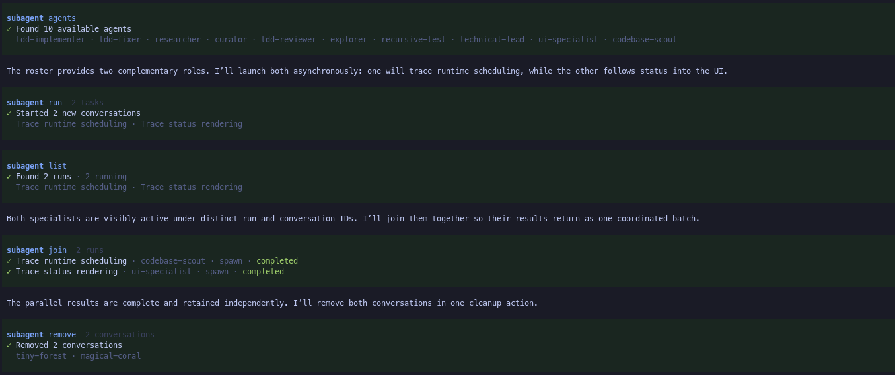
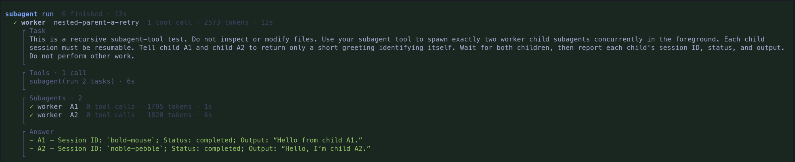

# @pi9/subagent

Delegate focused work from Pi to context-isolated child sessions with a single `subagent` tool. Use it for research, planning, review, investigation, test analysis, and implementation without crowding the parent conversation.



## Highlights

- **Resumable sessions** let the parent send follow-ups to the same child, which keeps its accumulated context across resumes instead of starting cold.
- **Background dispatch** runs a batch without blocking, so the parent keeps working and, by default, is notified when children finish.
- **Recursive subagents** spawn their own children, and the parent sees the whole tree as one run under a single shared concurrency limit.
- A **single tool** exposes distinct discovery, inventory, dispatch, retrieval, and cleanup actions, and its deliberately compact prompt won't bloat the parent's context.
- **Live, observable runs** show per-child status, tokens, and tool activity in the tool row, with background and resumable sessions also tracked in a configurable widget.
- **Zero-code configuration** puts concurrency, notifications, discovery, and layout in settings, with sensible defaults.

## Install

```bash
pi install npm:@pi9/subagent
```

## Quick start

1. **Install** the package (above).
2. **Define an agent** — drop a markdown file in `.pi/agents/` (see [Define agents](#define-agents) for the full frontmatter):

```markdown
---
name: scout
description: Read-only codebase reconnaissance
model: anthropic/claude-sonnet-4
tools: read, bash
---

You are a fast codebase scout. Return concise, evidence-backed findings with file paths.
```

3. **Delegate to it** — just ask the main agent in plain language:

> Run a scout subagent to find the auth entry points and summarize the relevant files.

The agent translates that into a `subagent` tool call:

```ts
subagent({
  action: "run",
  tasks: [{ agent: "scout", label: "auth entry points", prompt: "Find the auth entry points and summarize the relevant files." }]
})
```

4. **Watch it run** live in the tool row. Foreground results return from the call; for background runs, use `subagent results` with the returned session handles. Expanding the tool call stays concise while surfacing the task, compact previous runs, recent tool activity, recursive subagents, and the final answer in clearly labeled sections.



## Define agents

Add a markdown file in a discovered `agents/` directory:

```markdown
---
name: scout
description: Read-only codebase reconnaissance
model: anthropic/claude-sonnet-4
tools: read, bash
skills: codesearch
resumable: true
---

You are a fast codebase scout. Inspect the repository and return concise, evidence-backed findings with file paths.
```

Supported frontmatter:

| Field | Required | Meaning |
| --- | --- | --- |
| `name` | yes | Runtime agent name used in tool calls. |
| `description` | yes | Non-blank summary shown in tool results and browsers. |
| `model` | no | Model for this agent. Use `provider/model` or an unambiguous model id. |
| `thinking` | no | Thinking level for the child session: `off`, `minimal`, `low`, `medium`, `high`, `xhigh`, or `max`. |
| `tools` | no | Comma-separated tool allowlist. If set, include `subagent` for agents that should be able to delegate recursively. |
| `skills` | no | Comma-separated default skill names whose full instruction bodies are injected into the system prompt. Per-task `skills` replaces this list (no merge); use `none` or omit to declare none. |
| `resumable` | no | Boolean. When `true`, conversation context is retained for follow-up prompts. This is separate from background result retention. Resumability lasts for the current Pi process only — restart or extension reload releases it. |

The markdown body is trimmed and used as the child's system prompt.

## Agent discovery

Agents are markdown files discovered from:

1. User `${PI_AGENT_DIR ?? ~/.pi/agent}/agents`.
2. The nearest project `.pi/agents`, found by walking up from the tool's `cwd`.

Each file is registered by its frontmatter `name`, not by filename. Project agents override user agents with the same name by default; `agentDiscovery.duplicateNamePolicy` can reverse that precedence.

## Resumable sessions

Mark an agent `resumable: true` (or override per task) and its session is retained after it settles. The parent can then send a follow-up to the same `sessionId`, and the child continues with its accumulated context instead of starting cold. Session IDs are adjective-noun handles such as `quiet-otter`, unique within the current subagent runtime; pass them unchanged to resume, results, and remove. Spawns and resumes can be mixed in one batch:

```ts
subagent({
  action: "run",
  tasks: [
    { sessionId: "quiet-otter", prompt: "Use your earlier findings to propose the smallest implementation plan." },
    { agent: "reviewer", label: "independent plan review", prompt: "Independently review the new plan once it lands." }
  ]
})
```

Retention lasts for the current Pi process only — restart or extension reload releases it. Setting `resumable: false` on a follow-up prevents further follow-ups and releases its conversation context after that attempt; a foreground session then leaves inventory, while a background session remains listed for result retrieval or removal. Resume from the tool, or interactively from `/subagents`.

## Background dispatch

By default (`background: false`), a run waits for every task and returns their results. With `background: true`, the call returns session handles immediately while children continue independently. For the current Pi process, background sessions stay available to `list` and `results` until removed, even when `resumable: false`; this result retention does not make their conversation context resumable.

```ts
subagent({
  action: "run",
  background: true,
  tasks: [{ agent: "scout", label: "auth map", prompt: "Map auth code; respond when complete." }]
})
```

When a background child finishes, the parent is notified. The `backgroundNotify` setting decides how: coalesce until the parent is idle (`auto`), steer into the active turn (`steer`), or stay silent (`none`). Notifications carry only metadata — fetch the actual output with `subagent results`.

## Recursive subagents

Give an agent the `subagent` tool in its `tools` allowlist and it can spawn its own children. The parent sees the whole tree as one coherent run: nested children appear under their parent, counts and elapsed time aggregate across the tree, and a single shared concurrency limit applies across all levels so recursive fan-out stays bounded.

## Live display

While subagents run, two surfaces keep you in the loop: the tool row in the transcript, and a persistent widget outside it.

### Tool row

While a `run` is executing, the tool row shows one line per child with status, agent and optional `label`, tool-call count, tokens, elapsed time, and recent tool calls. Finished children collapse to just their row:

```text
  ⠋ reviewer  auth review  4 tool calls · 18420 tokens · 37s
    ⠋ bash npm test · 12s
    ✓ grep "formatRunSessionLine" in src · 1s
    ✓ read src/view/tool-result-lines.ts · 0s
    +1 additional tool call
```

Expanding the tool call shows labeled Task, Tools, and Answer sections. Tools use the same compact activity view as the collapsed row: the three newest calls plus an additional-call count. For resumed sessions, each previous run gets a two-line Previous Run section containing a truncated prompt and response. Recursive children appear as collapsed-style rows in a Subagents section. Mixed child failures still preserve successful results.

### Progress widget

A lightweight widget groups background sessions and foreground resumable sessions, including terminal entries retained in the current process. Transient foreground runs remain in the tool row; when another widget section is present, their active count can appear in its footer. The widget auto-hides when it has no background or resumable section. Nested children appear under their parent with depth-based indentation.

Configure placement and layout in `/subagents settings`:

| Setting | Values |
| --- | --- |
| `widgetPlacement` | `belowEditor` (default), `aboveEditor`, `off`. `off` disables only the widget; tool rendering and `/subagents` still work. |
| `widgetLayout` | `auto` (default — columns when terminal is wide enough, otherwise stacked), `columns`, `stacked`. |

## Settings

Settings are global per user and stored at `${PI_AGENT_DIR ?? ~/.pi/agent}/subagent/settings.json`. Missing or invalid values fall back to defaults. Changing a value through `/subagents settings` writes the normalized settings object to this file.

The runtime knobs are the ones most users will reach for:

```json
{
  "runtime": {
    "maxTasksPerRun": 8,
    "maxConcurrentSubagents": 4,
    "defaultResumable": false,
    "backgroundNotify": "auto"
  }
}
```

- `maxConcurrentSubagents` is a **tree-wide** cap across recursive subagents (one shared queue owns the whole subagent tree).
- `defaultResumable` only applies when an agent definition omits `resumable`; explicit frontmatter and per-task overrides still win.
- `backgroundNotify` controls how a finishing background subagent notifies the parent:
  - `auto` (default) — coalesce completion metadata and deliver it once the parent is idle.
  - `steer` — inject a steering-style notification into the currently active run, falling back to a new turn if idle.
  - `none` — do not notify; the parent must call `subagent list` or `subagent results` to discover completions.

Beyond runtime, the settings file also has an `agentDiscovery` section (toggles for user/project sources, file extensions, duplicate-name policy, and invalid-definition warnings) and a `display` section (truncation lengths, widget visibility, and row caps). Defaults are tuned to be reasonable; reach for them only when something is being cut off or you need to narrow discovery.

`/subagents settings` exposes placement, layout, notification mode, concurrency, per-run task limits, default resumability, retained-row visibility, and widget row limits. Discovery and the remaining display controls are file-only.

## `/subagents` command

Run `/subagents` to inspect and manage subagents from the UI. This is a separate interactive surface; its inspection view may show richer diagnostic details than the model-facing `list` action.

When active or retained sessions exist, it opens the Sessions view, where you can:

- Inspect status, agent metadata, prompt preview, counters, timestamps, usage, and output/error snippets.
- Resume a completed resumable session (or a resume attempt that failed before re-attaching). The command asks for a follow-up prompt, runs with a cancellable loader, updates the widget live, and appends a concise result message to the main conversation.
- Remove any non-running session still in inventory, including completed non-resumable background results.
- Open Settings with `s`, or switch to the Agents browser with `tab` when discovery is available.

If no sessions exist, `/subagents` opens the read-only Agents browser, which lists discovered agent definitions and their metadata. It does not launch agents.

Run `/subagents settings` to open Settings directly, or `/subagents agents` / `/subagents sessions` to jump straight to a view. All views share the same movement keys, including configured select keybindings and `j`/`k`.

## Events and persistence

The package emits `subagent:updated`, `subagent:queued`, `subagent:started`, and `subagent:completed` events on the host event bus, so other extensions can react without polling the tool. It also appends a compact `subagent-session-index` entry for each terminal attempt to the current Pi session log, containing status, timing, prompt previews, and output/error snippets. These entries preserve activity metadata, but child conversations themselves are process-local and are not restored after restart or extension reload. In the interactive UI, switching or forking while children are queued or running asks for confirmation before tearing down that runtime.

## The `subagent` tool

The tool takes one required `action`. Actions are deliberately separate; their parameter shapes live in `src/schema.ts` and are surfaced through the tool schema:

| Action | What it does |
| --- | --- |
| `agents` | Discover available agent definitions. |
| `list` | Return a lightweight runtime inventory. An optional `status` filter selects normalized statuses. |
| `run` | Start new sessions via `agent` and/or resume retained sessions via `sessionId`. `background: true` dispatches without blocking. |
| `results` | Retrieve full, untruncated output or error by `sessionIds`; pending sessions are reported without blocking. |
| `remove` | Abort running sessions and discard queued or retained session state by `sessionIds`. |

### List summaries

Each `list` session summary has exactly these fields:

- `sessionId`
- `agent`
- optional `label` and `parentSessionId`
- normalized `status`: `queued`, `running`, `completed`, `error`, `aborted`, `interrupted`, or `skipped`
- `dispatch`: `foreground` or `background`
- `capabilities`: `canResume` and `canRemove`

`list` no longer returns prompts, output/error, activity/tool history, tool-call or token counts, elapsed time, usage, previous runs, `config`/`effectiveConfig`, timestamps, or retention. Its collapsed view uses the same status icons and agent/label rows as `results`; expansion adds inventory metadata. `results` is the only way to retrieve full, untruncated output/error by handle; it is nonblocking even for pending sessions.

### Background flow

The canonical background flow is: `agents` (optional if known) → `run(background)` → `list` (optional if handles known) → `results` → `remove`.

`run(background: true)` returns session handles immediately. Its collapsed result shows only the started count; expand it to see each agent, task label, and handle. Use `list` only when a lightweight status check or status filter is useful; if handles are already known, call `results` directly. `results` remains nonblocking for pending sessions and returns their current status until they settle. `results.remove` remains an atomic terminal collect-and-clean convenience: it returns the requested entries and removes terminal sessions in the same operation, while pending sessions remain available. Use `remove` when sessions should be aborted or discarded without collecting their full result.

Spawn tasks require `label` and accept `model`, `thinking`, `cwd`, `skills`, and `resumable` overrides. Resume tasks accept optional `label` and `resumable` overrides; `model`, `thinking`, `cwd`, and `skills` are fixed when the child session is created. Selected skills are resolved by name and their full instruction bodies are injected into the child system prompt; an unknown or unreadable skill fails the run before the child session starts. Agent discovery applies the configured default `defaultResumable` because a task can override it. Sessions move through `queued → running → completed`, or end in `error`, `aborted`, `interrupted`, or `skipped`; only a `completed` resumable session (or a resume that failed before re-attaching) can be resumed. A foreground `run` returns settled results directly; background handles and `results` entries include a session ID for retrieval or removal even when conversation context is not resumable.

Inventory advertises `canRemove` only for terminal sessions that remain cataloged; queued and running sessions report `false`. This is the safe interactive capability, not authorization: an explicit `remove` call can still remove a queued session or abort a running one.

This action separation is a clean breaking change. There are no legacy `list` fields or compatibility aliases; callers must use the separated actions and current inventory fields.

## Architecture

```
src/
├── index.ts         — Extension entry; wires the registry, manager, tool, command, and widget.
├── schema.ts        — TypeBox tool parameters and action-specific runtime parsing.
├── config/          — Settings types, defaults, and `settings.json` load/save.
├── domain/          — Session state, lifecycle decisions, and result projections.
│   ├── agent.ts          — The Agent class: one child session, its attempts, and lifecycle.
│   ├── agent-registry.ts — Discovers and indexes agent definitions from user/project dirs.
│   ├── agent-snapshot.ts — Immutable state view used for rendering.
│   └── ...               — Config parsing, result projection, attempt/finalize/decision helpers.
├── runtime/         — Execution machinery.
│   ├── agent-manager.ts  — Top-level coordinator owning the registry, attempt runner, and run groups.
│   ├── task-queue.ts     — Tree-wide concurrency queue shared across recursive subagents.
│   ├── run-group.ts      — One `run` call: tracks input order and surfaces tree state.
│   ├── run-agent.ts      — Builds and runs the underlying SDK AgentSession for one attempt.
│   └── ...               — Attempt dispatch, background notifier, extension cache, timing.
├── tool/            — The `subagent` tool: definition, action handlers, and the factory injected into children.
├── command/         — The `/subagents` slash command: registration, multi-step flows, and a `components/` subfolder with Sessions/Agents/Settings/resume-loader TUI components.
├── ui/widget.ts     — The persistent progress widget shown outside the tool row.
└── view/            — Rendering helpers shared by tool, command, and widget.
    ├── tool-result-lines.ts — Collapsed/expanded line generation for the tool row.
    ├── session-lines.ts     — Per-session line formatting used by widget and tool row.
    ├── widget-component.ts  — Top-level widget renderer with stacked vs. side-by-side layout.
    └── ...                  — Details payloads, serialization, resume message, format/view helpers.
```
