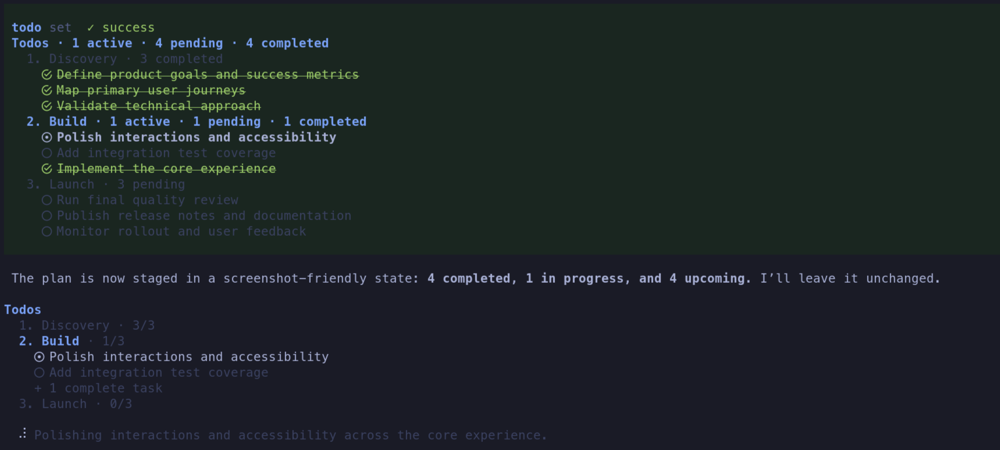

# @pi9/todo

A phased, session-aware todo tool for the [Pi coding agent](https://github.com/earendil-works/pi-mono), with adaptive system reminders and a persistent widget that keeps the current plan visible while you work.



## Features

- **Phased planning.** Organize work into concise phases with immutable task names, detailed descriptions, and explicit `pending`, `in_progress`, `completed`, or `cancelled` statuses.
- **Context-efficient tool.** A compact, purpose-built tool description gives the model clear planning controls while consuming minimal context-window space.
- **Session-aware state.** Todo snapshots travel with Pi session branches, so `/tree` navigation restores the plan associated with each branch.
- **Persistent widget.** Keep active work visible above or below the editor, with configurable placement, task limits, and status glyphs.
- **Adaptive reminders.** System reminders refresh the model's awareness of stale plans during long runs and restore the full plan after context compaction.
- **Native tool rendering.** Compact tool output summarizes active work and expands into phase progress while respecting configurable visibility settings.

## Install

```bash
pi install npm:@pi9/todo
```

For local development:

```bash
pi -e ./packages/todo/src/index.ts
```

## UI settings

The settings loader reads global settings from `~/.pi/agent/todo/settings.json`. For a trusted project, `.pi/todo/settings.json` overrides the global values. Pi's project-trust decision is required before the project file is read; an untrusted project cannot affect these settings.

```json
{
  "widgetPlacement": "aboveEditor",
  "maxVisibleTasks": 5,
  "fallbackGlyphs": false,
  "toolVisibility": "set-only",
  "dynamicReminders": true,
  "reminderMinTurns": 4,
  "reminderMaxTurns": 8,
  "reminderOutputTokens": 16000,
  "reminderMaxPerRun": 2
}
```

`widgetPlacement` accepts `"aboveEditor"`, `"belowEditor"`, or `"off"`. `maxVisibleTasks` must be a positive integer, and `fallbackGlyphs` must be a boolean. Nerd Font status glyphs are the default; set `fallbackGlyphs` to `true` to use broadly supported Unicode symbols instead.

`toolVisibility` controls Todo tool output in the terminal UI only:

- `"all"` shows every Todo action.
- `"set-only"` shows only `set` operations.
- `"none"` hides normal Todo activity.

Errors are always shown, while hidden successful operations take up no terminal space. Expanded output stays synchronized with the latest plan on the active branch.

Dynamic reminders keep the model aware of the plan during longer runs without adding messages to session history. The turn, output-token, and per-run settings control their cadence; set `dynamicReminders` to `false` to disable them.

After Pi compacts the context window, the extension supplies the full phased plan once on the next turn so work can continue without losing task state. This does not alter Pi's compaction summary or session history.

Settings load when a session starts. The widget refreshes after todo changes and `/tree` navigation. Active tasks keep their normal status glyph; when work is active, a separate indented current-work line below the plan uses Pi's standard spinner and dim text. After all tasks become terminal, the widget shows the final phase summary for five seconds before clearing. Set `widgetPlacement` to `"off"` to disable the widget.

## Development

```bash
npm run typecheck --workspace @pi9/todo
npm test --workspace @pi9/todo
```
